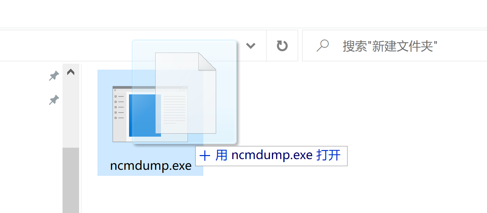

# ncmdump.go - 导出网易云音乐 NCM 格式

<!-- TOC depthFrom:2 -->

- [简介](#简介)
- [格式分析](#格式分析)
- [如何使用？](#如何使用)
    - [Windows 下调用](#windows-下调用)
- [已知问题](#已知问题)
- [相关链接](#相关链接)

<!-- /TOC -->

## 简介

我们从网易云音乐下载到本地的歌曲，有些往往不是 mp3 或者 flac 等普通的音频格式、往往是 NCM 格式，这是因为云音乐对于版权方面顾虑的保护措施。但对于我们这些即便是付费用户而言，想要从云音乐下载的歌曲到第三方软件播放，这也是一件非常困扰的事情。

所以就有了这个项目用于导出网易云音乐 NCM 格式的相关内容，本项目完全参考 [anonymous5l/ncmdump](https://github.com/anonymous5l/ncmdump)，并使用 golang 实现，起初是为了能在 Windows 下快速编译和运行。

## 格式分析

NCM 实际上不是音频格式是容器格式，封装了对应格式的 Meta 以及封面等信息，主要的格式如下：


因此，需要解开原格式信息的关键就是拿到 AES 的 KEY，好在每个 NCM 的加密的 KEY 都是一致的（出于性能考虑？）。所以，我们只要拿到 AES 的 KEY 以后，就可以根据格式解开对应的资源。


## 如何使用？

<delete>为了避免不必要的麻烦，本项目不提供可执行文件。如果您需要对应需要的功能，请自行封装和编译。</delete> 为了使用方便只提供 Windows 版本的可执行文件下载，同时参看下方的使用方法。

使用 `go get -u github.com/mingcheng/ncmdump.go` 下载包到本地，然后调用传入对应的文件句柄即可，示例代码：

```golang
import (
	"fmt"
	"github.com/mingcheng/ncmdump.go"
    //...
)
```

然后获得文件的 Meta 信息

```golang
fp, err := os.Open(name)
if err != nil {
    log.Println(err)
    return
}
defer fp.Close()

if meta, err := ncmdump.DumpMeta(fp); err != nil {
    log.Fatal(err)
} else {
    fmt.Printf("%s: %s\n", name, meta.Format)
}
```

顺便提一句，为了转换以及处理方便，使用 `ncmdump.Dump(fp)` 会将已经解出来的原音乐格式放入内存中，如果想直接写入文件建议修改 writer 的指向即可。

### Windows 下调用

Windows 下使用本程序很简单，只需要将对应的 NCM 文件或者包含 NCM 文件的文件夹拉到对应的 EXE 可执行文件即可。如图：



然后 ncmdump 即会在对应同个文件夹下生成同名字的导出格式。如果有对应的封面图片等信息，会自动从网上抓取并更新，这一切都是自动的，不需要任何的配置以及更新。


## 已知问题

新版的云音乐已经不在 NCM 嵌入图片以及 Meta 等信息，因此使用 `ncmdump.DumpMeta` 去调用的时候，需要检查 Meta 信息的完整性。如果您需要 Meta 等信息，建议不要使用最新的客户端。

## 相关链接

- http://www.bewindoweb.com/228.html
- [@anonymous5l](https://github.com/anonymous5l)提供的原版 ncmdump
- [@eternal-flame-AD](https://github.com/eternal-flame-AD)提供的flac封面写入和目录自动寻找ncm文件

`- eof -`
